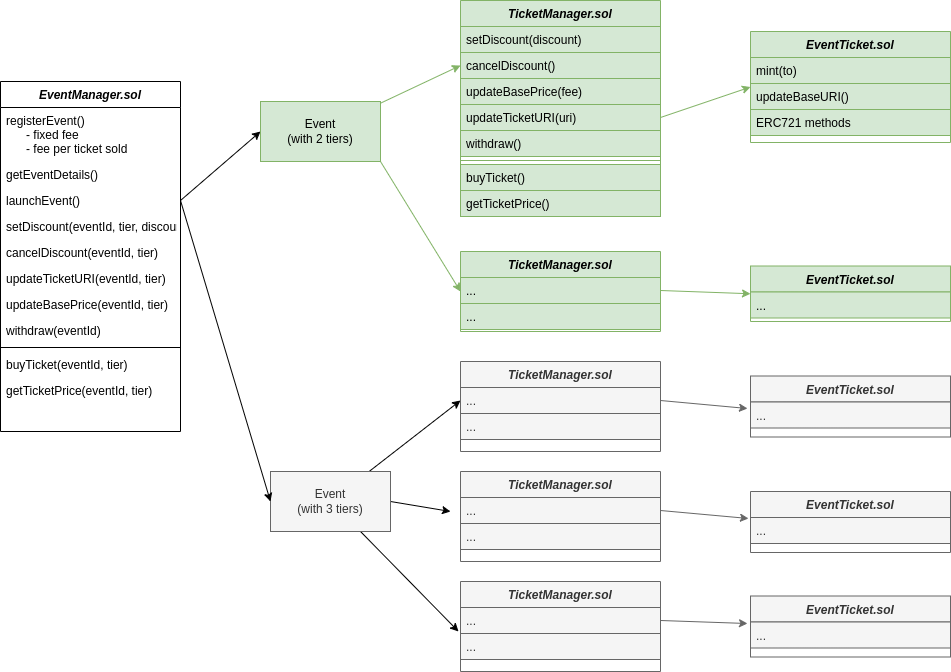

# FlexTicket

> Makes web3 events accessible
> and prices fair for everyone

FlexTicket is a web3 ticketing platform that offers dynamic pricing
for web3 events tickets.

Adjusting ticket prices in real-time based on market demand, ensures tickets
are priced fairly and events are accessible to a wider range of attendees.

Additionally, optimizes revenue potential and reduces the risk of unsold
inventory for event organizers.

## Architecture



## Features

This was build using the typescript repo of scaffold-eth. Use scaffold-eth-typescript with:

- A react frontend running with `nextjs` or `vite`.
- Solidity toolkit of `hardhat` or `foundry`
- It has the a command line system that allows you to choose a **react frontend** or **solidity toolkit**

## Quick Start

### Starting the App

Running the app

1. install your dependencies, `open a new command prompt`

   ```bash
   yarn install
   ```

2. Create a default `scaffold.config.json` configuration file

   ```bash
   yarn create-config
   ```

3. start a local hardhat node (chain)

   ```bash
   yarn chain
   ```

4. Run the app, `open a new command prompt terminal`

   ```bash
   # in a new terminal
   # compile your contracts
   yarn compile
   # deploy your hardhat contracts
   yarn deploy
   # start the react app (vite)
   yarn start
   ```

5. Open http://localhost:3000 to see your front end

## Configuration

Scaffold uses `scaffold.config.json` as a configuration file located in `/packages/common/scaffold.config.json`. You can create the config file by running the command `yarn create-config`.

### Command line help

```bash
use `-h` with any command for help.  e.g. yarn set-react -h
```

### Configure react and solidity toolkit

You can change the configuration file to pick different frontends and solidity toolkits.

```bash
yarn set-react `nextjs` or `vite`
yarn set-solidity `hardhat` or `foundry`
```

### Target network

Set your `targetNetwork` in the config. This is the network the solidity toolkit is deploying against.

Set your `availableNetworks` in the config. This is the networks the frontend is available in.

You can configure it from the **config file** or from **command line**.

```bash
yarn set-network -h
yarn set-network 'localhost' 'localhost, mainnet'
```

### More commands

You can see all the other commands by using `yarn scaffold`

## Solidity Tookits Details

### Hardhat

Everything will be installed with `yarn install`.

You can use hardhat with right context using

```bash
yarn hardhat
```

### Foundry

Make sure you install foundry

1. Make sure you install foundry first. Use `curl -L https://foundry.paradigm.xyz | bash` to install foundryup

   > You can see more details here. https://book.getfoundry.sh/getting-started/installation

2. Run `yarn install:foundry` to install or update foundry in the right folder. It will also run _forge install_ automatically with the right context.

You can use foundry commands with the right context

```bash
yarn forge
yarn anvil
yarn cast
```

## Directories

The directories that you'll use are:

```bash
packages/solidity-ts/

And one of either:
packages/vite-app-ts/
packages/next-app-ts/
```

### More Info

Other commands

```bash
# rebuild all contracts, incase of inconsistent state
yarn contracts:clean
yarn contracts:build
# run hardhat commands for the workspace, or see all tasks
yarn hardhat 'xxx'
# run forge, anvil or
yarn forge
yarn anvil
yarn cast
```

Other folders

```bash
# for subgraph checkout README.md in following directories
packages/subgraph/
packages/services/
```
